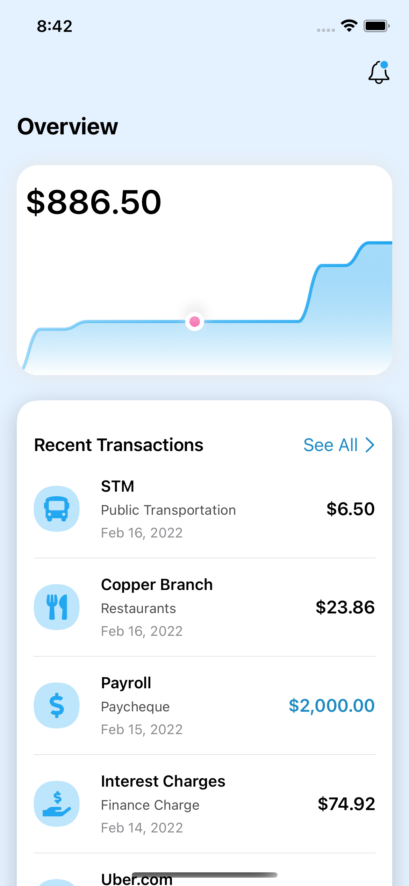
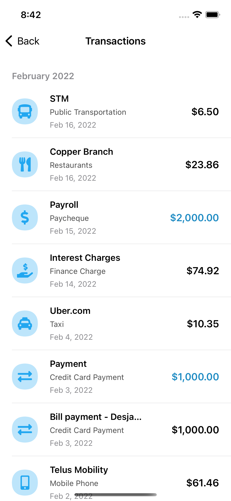

# ExpenseTracker

A SwiftUI demo project.

<table>
<thead>
  <tr>
    <th colspan="2">
Homepage
</th>
  </tr>
</thead>
<tbody>
  <tr>
    <td>
     
    </td>
    <td>
    
    </td>
  </tr>
  <tr> 
    <th colspan="2">
    

  <b>Recent Transactions -> See All</b>

</th>
  </tr>
  <tr>
    <td>  </td>
    <td>   </td>
  </tr>
</tbody>
</table>
